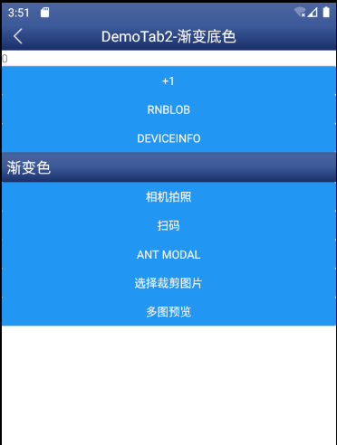

# 页面布局

## 由`PageContainer包裹住`,传一个带`flex:1`的滚动条或者 view

```tsx
<PageContainer navBarProps={{ title: "Page1" }}>
  <ScrollView contentContainerStyle={styles.container}></ScrollView>
</PageContainer>
```

## 有自带沉浸式 header，可隐藏，可设置渐变色



## 已预留 iphoneX 底部占位 View，白色底，可传`bottomStyle`来修改

底部默认占位高度`configStore.screenInset.bottom`

## 监听页面进入和离开 `onDidFocus` `onDidBlur`

```tsx
<PageContainer
  navBarProps={{ title: "Page1" }}
  onDidFocus={() => console.log("进入页面")}
  onDidBlur={() => console.log("离开页面")}
></PageContainer>
```

## 自定义 header 背景图片，请直接引用`Navbar`

```tsx
<PageContainer isHiddenNavBar={true}>
  <View style={styles.container}>
    <Image
      source={require("./assets/bg.jpg")}
      style={{
        height: 300,
        width: "100%",
        position: "absolute",
        top: 0,
        left: 0
      }}
    />
    <NavBar title="DemoTab1" backgroundColor="transparent" />
    <ScrollView contentContainerStyle={styles.container}>
      <Text>content</Text>
    </ScrollView>
    <BottomTab routeName="DemoTab1" />
  </View>
</PageContainer>
```


## 自定头部按钮, 文字和图片按钮

```tsx
<PageContainer
  navBarProps={{
    showPopBtn: false,
    renderRight: (
      <NavBar.Button>
        <Image style={{ width: 20, height: 20 }} source={require("./assets/dog.jpg")} resizeMode="contain" />
      </NavBar.Button>
    ),
    renderLeft: <NavBar.TextButton>左</NavBar.TextButton>
  }}
>
```
